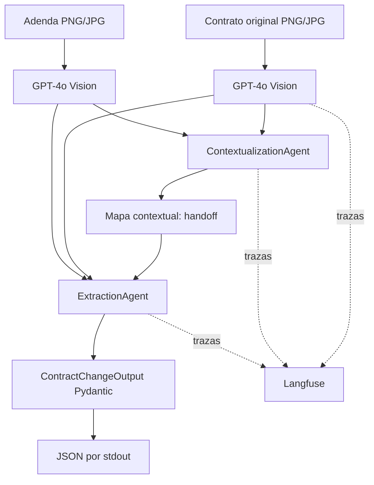

# LegalMove — Proyecto Integrador M4

LegalMove compara un contrato original y una adenda recibidos como imágenes. Extrae los dos documentos con GPT-4o Vision, entrega el contexto a un primer agente y pide a un segundo agente que devuelva cambios legales validados con Pydantic.

## Arquitectura



El primer agente solo ordena secciones, correspondencias y ambigüedades. El segundo recibe ese mapa obligatoriamente y clasifica adiciones, eliminaciones y modificaciones. Así cada agente tiene una responsabilidad clara.

## Instalación

Desde esta carpeta:

```powershell
python -m venv .venv
.venv\Scripts\Activate.ps1
pip install -r requirements-dev.txt
Copy-Item .env.example .env
```

En Linux/macOS:

```bash
python -m venv .venv
source .venv/bin/activate
pip install -r requirements-dev.txt
cp .env.example .env
```

Completá las claves de OpenAI y Langfuse en `.env`. No subas ese archivo a Git.

## Ejecutar

Caso simple:

```powershell
python -m src.main data/test_contracts/caso_simple/contrato_original.png data/test_contracts/caso_simple/adenda.png
```

Caso complejo:

```powershell
python -m src.main data/test_contracts/caso_complejo/contrato_original.png data/test_contracts/caso_complejo/adenda.png
```

La salida estándar contiene exclusivamente este contrato JSON:

```json
{
  "sections_changed": ["Cláusula 2 - Monto mensual"],
  "topics_touched": ["precio del servicio"],
  "summary_of_the_change": "MODIFICACIÓN: ..."
}
```

Los errores salen por stderr y el proceso termina con código distinto de cero.

## Pruebas

```powershell
pytest -q
```

Las pruebas usan clientes simulados: no consumen créditos ni requieren claves. Cubren validación de imágenes, modelo Pydantic, handoff entre agentes, orden del pipeline y CLI.

## Trazas en Langfuse

Abrí el proyecto configurado en `LANGFUSE_HOST` y buscá la traza `contract-analysis`. Contiene: `parse_original_contract`, `parse_amendment_contract`, `contextualization_agent`, `extraction_agent` y `pydantic_validation`. Las generaciones hijas registran modelo, tokens, latencia y estado; los spans de parsing agregan nombre, tamaño y hash del archivo.

## Decisiones y seguridad

- GPT-4o se usa porque admite imágenes y texto; el parser le prohíbe resumir o inventar.
- LangChain implementa los dos roles y structured outputs.
- Pydantic rechaza campos extras, listas vacías y resúmenes demasiado cortos.
- Langfuse registra auditoría sin guardar la imagen binaria: solo su nombre, tamaño y hash.
- Los documentos de `data/` son sintéticos. En producción, aplicá controles de acceso, retención mínima y revisión humana para decisiones legales.

Para la exposición, seguí [GUIA_DEFENSA_30_MIN.md](docs/GUIA_DEFENSA_30_MIN.md) y la matriz [RUBRICA_CUBIERTA.md](docs/RUBRICA_CUBIERTA.md).
