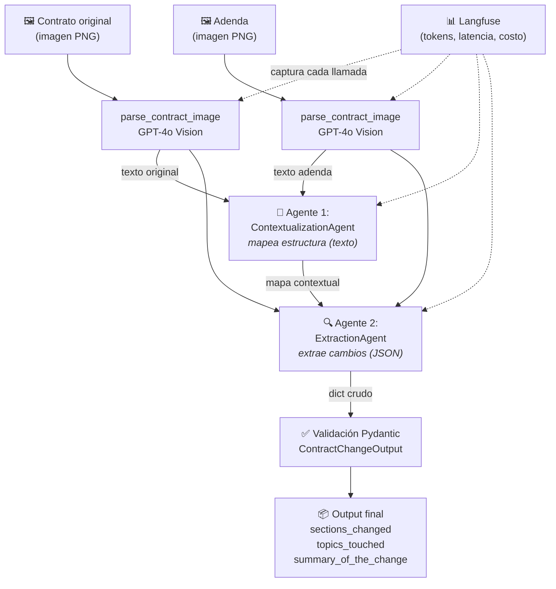

# LegalMove — PIM4 (Proyecto Integrador Módulo 4)

**LegalMove** es un sistema que compara un **contrato original** con su **adenda** y
extrae automáticamente los cambios introducidos (adiciones, eliminaciones y
modificaciones), devolviendo un resultado **estructurado y validado**.

Combina cuatro piezas de un pipeline de IA de producción:

- **Parsing multimodal** con GPT-4o Vision (lee las imágenes de los contratos).
- **Arquitectura de 2 agentes** con LangChain (contextualización → extracción).
- **Validación con Pydantic** (frontera de producción del output).
- **Trazabilidad con Langfuse** (observabilidad de cada llamada al LLM).

---

## Estructura del proyecto

```
proyecto_integrador/
├── src/                                # Código fuente del pipeline
│   ├── main.py                         # Entry point CLI (recibe 2 paths de imagen)
│   ├── pipeline.py                     # Orquestación + traza local (Trace/Span)
│   ├── image_parser.py                 # parse_contract_image() con GPT-4o Vision
│   ├── models.py                       # ContractChangeOutput (Pydantic)
│   ├── tracing.py                      # Handler de Langfuse
│   └── agents/
│       ├── contextualization_agent.py  # Agente 1: mapea estructura (texto)
│       └── extraction_agent.py         # Agente 2: extrae cambios (JSON validado)
├── data/
│   └── test_contracts/
│       ├── pair1_simple/               # Par 1: 1 cambio (modificación de duración)
│       ├── pair2_complex/              # Par 2: 3 cambios (modif. + eliminación + adición)
│       ├── generate_data.py            # Regenera las imágenes y los golden expected.json
│       └── README.md                   # Detalle de los 2 pares de prueba
├── requirements.txt
├── .env.example
└── README.md                           # (este archivo)
```

---

## Setup

Requiere **Python 3.10+**.

```bash
cd proyecto_integrador

# 1. Entorno virtual (recomendado)
python -m venv .venv
# Windows:
.venv\Scripts\activate
# Linux/Mac:
source .venv/bin/activate

# 2. Dependencias
pip install -r requirements.txt

# 3. Variables de entorno (OBLIGATORIO: requiere OPENAI_API_KEY)
cp .env.example .env       # y completar las claves reales
```

> Este proyecto llama a la **API real de OpenAI** (Vision + agentes). Necesitás un
> `OPENAI_API_KEY` válido en `.env`. Las claves de Langfuse son opcionales: si no
> las cargás, el pipeline corre igual y muestra solo la traza local.

---

## Uso

### 1. Generar los datos de prueba

Las imágenes de los contratos se generan con Pillow (no se versionan):

```bash
python data/test_contracts/generate_data.py
```

Crea los 4 PNG (2 pares) y sus `expected.json` (resultados esperados / *golden cases*).

### 2. Ejecutar el pipeline

```bash
# Par 1 (simple)
python src/main.py \
  data/test_contracts/pair1_simple/contrato_original.png \
  data/test_contracts/pair1_simple/adenda_simple.png

# Par 2 (complejo)
python src/main.py \
  data/test_contracts/pair2_complex/contrato_original.png \
  data/test_contracts/pair2_complex/adenda_compleja.png

# Sin enviar a Langfuse:
python src/main.py contrato.png adenda.png --no-langfuse
```

La salida imprime la **traza jerárquica local** (5 spans con latencia y estado), el
**`ContractChangeOutput`** final validado por Pydantic y, si Langfuse está activo, la
**URL de la traza** con tokens y costo.

---

## Arquitectura



Cada etapa se registra como un **span** dentro de un **trace** raíz (`contract-analysis`),
tanto en la traza local de consola como en el dashboard de Langfuse.

---

## Mapeo a la rúbrica oficial

| Criterio | Pts | ¿Dónde se cumple? |
|---|---|---|
| 1.1 Parsing Multimodal | 15 | [`src/image_parser.py`](src/image_parser.py) — GPT-4o Vision vía LangChain |
| 1.2 Arquitectura 2 Agentes | 15 | [`src/agents/`](src/agents) — Contextualization + Extraction |
| 1.3 Validación Pydantic | 10 | [`src/models.py`](src/models.py) — `ContractChangeOutput` + validators |
| 2.1 Calidad de Prompting | 15 | System prompts especializados en cada agente y en el parser |
| 2.2 Gestión de API y Errores | 10 | `.env` + `requirements.txt` + manejo de errores en `pipeline.py` |
| 3.1 Trazabilidad Langfuse | 15 | [`src/tracing.py`](src/tracing.py) + spans en [`src/pipeline.py`](src/pipeline.py) |
| 4.1 Estructura y README | 10 | Estructura `src/` modular + este README |
| 5.1 Defensa en vivo | 10 | Defensa oral del diseño (2 agentes, Pydantic, Vision, Langfuse) |
