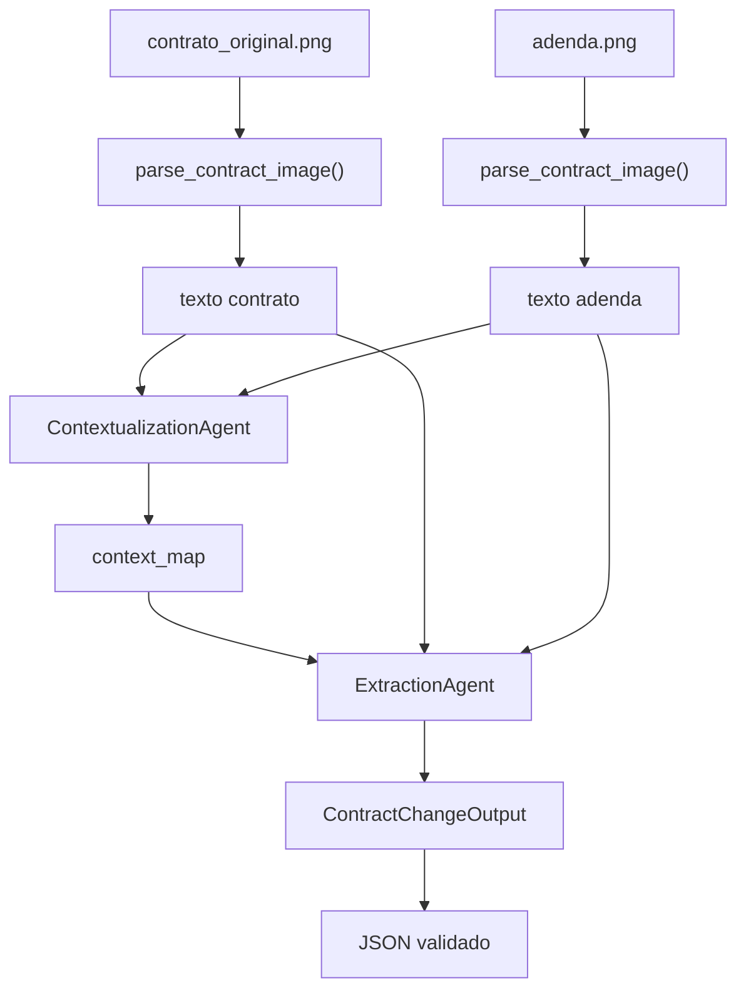
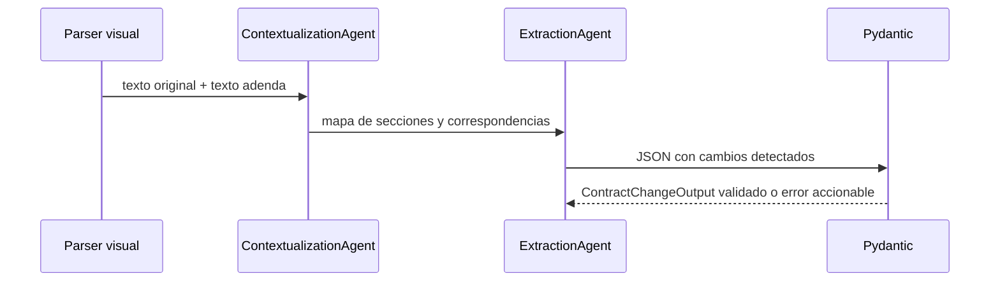
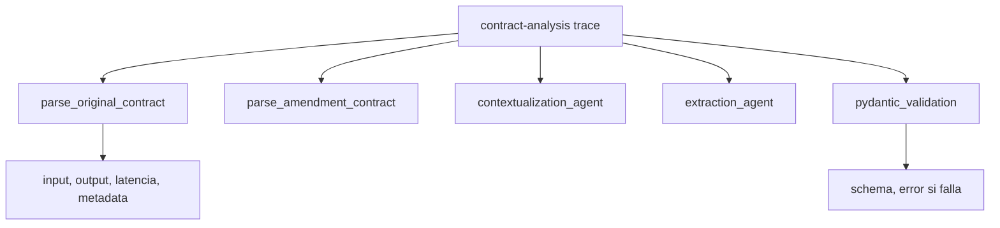

# PIM4 | LegalMove Python

Ejercicios Python para explicar y practicar el proyecto integrador del modulo 4:
un agente autonomo que compara un contrato original contra una adenda, extrae
texto desde imagenes, coordina dos agentes, valida JSON con Pydantic y deja una
traza auditable del workflow.

Los scripts corren por defecto en modo mock deterministico para clase. Si se
quiere usar OpenAI Vision y Langfuse reales, activar los flags indicados abajo y
configurar `.env`.

## Mapa del pipeline



## Handoff entre agentes



## Trazabilidad esperada



## Rúbrica traducida a código

| Rubrica | Donde se practica |
|---|---|
| Parsing multimodal | `parse_contract_image()` en `legalmove_core.py` |
| Arquitectura de dos agentes | `ContextualizationAgent` y `ExtractionAgent` |
| Validacion Pydantic | `ContractChangeOutput` y `validate_contract_change_output()` |
| Prompting especializado | Parser visual, agente contextual y agente extractor |
| Gestion de errores | validacion de path, extension, schema y fallos controlados |
| Trazabilidad | `Trace`, `Span` y `run_pipeline()` |
| Demo y defensa | casos simple y complejo con golden outputs |

## Datos visuales

Los casos de clase usan imagenes existentes:

- `data/contrato_original.png`
- `data/adenda_simple.png`
- `data/adenda_compleja.png`

Y golden cases:

- `data/expected/cambio_simple.json`
- `data/expected/cambio_complejo.json`

## Ejercicios

| Archivo | Foco pedagogico | Concepto clave |
|---|---|---|
| `e01_comparador_basico_vs_agentes.py` | De prompt monolitico a dos agentes | separar contexto de extraccion |
| `e02_output_libre_vs_pydantic.py` | De texto libre a schema validado | Pydantic como frontera de produccion |
| `e03_sin_logs_vs_langfuse.py` | De fallo opaco a trace auditable | spans por etapa |

## Cómo ejecutar

Desde la raiz del repositorio:

```bash
python3 proyecto_integrador/python/PIM4_legalmove/e01_comparador_basico_vs_agentes.py
python3 proyecto_integrador/python/PIM4_legalmove/e02_output_libre_vs_pydantic.py
python3 proyecto_integrador/python/PIM4_legalmove/e03_sin_logs_vs_langfuse.py
```

Modo con API real:

```bash
python3 proyecto_integrador/python/PIM4_legalmove/e01_comparador_basico_vs_agentes.py --real-api
python3 proyecto_integrador/python/PIM4_legalmove/e03_sin_logs_vs_langfuse.py --real-api --langfuse
```

## Variables de entorno

Copiar `.env.example` a `.env` dentro de esta carpeta si se usa API real.

```env
OPENAI_API_KEY=your-key-here
OPENAI_MODEL=gpt-4o-mini
OPENAI_VISION_MODEL=gpt-4o
LANGFUSE_PUBLIC_KEY=pk-lf-xxx
LANGFUSE_SECRET_KEY=sk-lf-xxx
LANGFUSE_HOST=https://cloud.langfuse.com
PIM4_USE_REAL_API=0
PIM4_USE_LANGFUSE=0
```

## Guion corto para clase

1. Mostrar el problema LegalMove: compliance compara contratos y adendas a mano.
2. Ejecutar E01 para explicar por que un prompt unico es fragil.
3. Ejecutar E02 para mostrar que un JSON bonito no alcanza si no valida.
4. Ejecutar E03 para mostrar el pipeline completo con spans.
5. Cerrar con la defensa: vision, dos agentes, Pydantic y trazabilidad.

Frase clave: primero leemos, despues contextualizamos, despues extraemos, y al
final validamos y auditamos.
